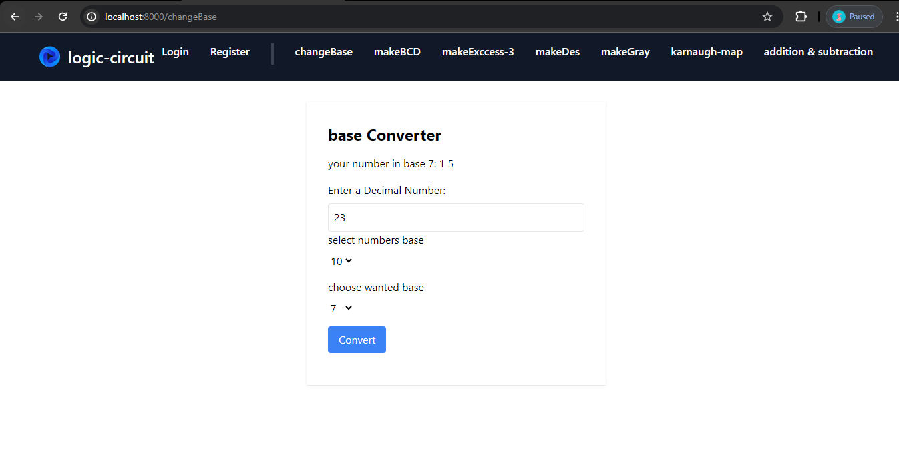
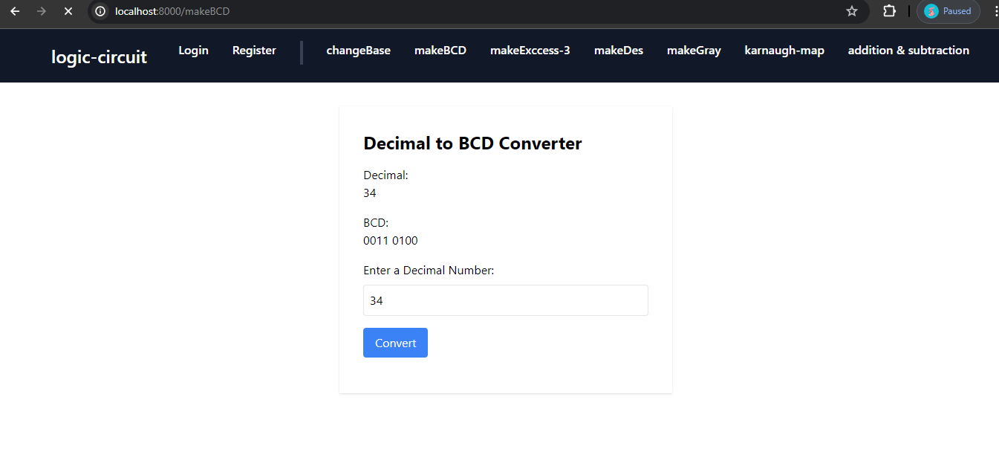
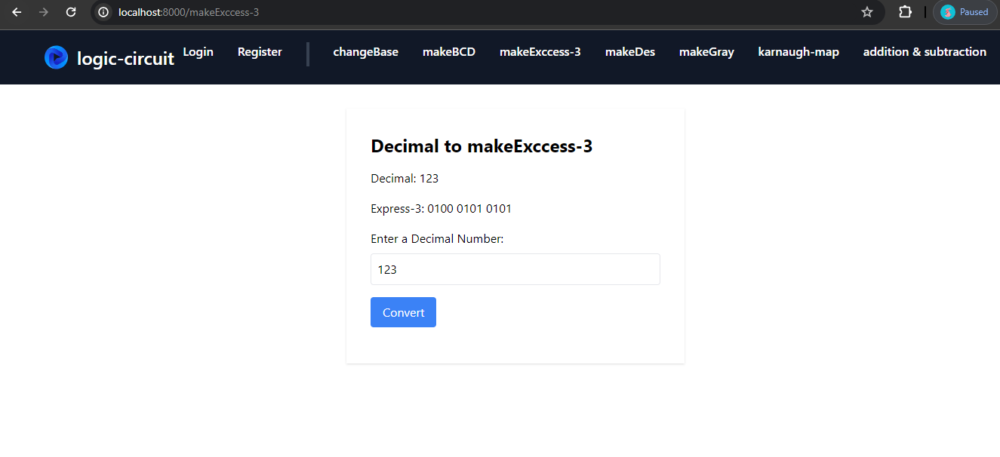
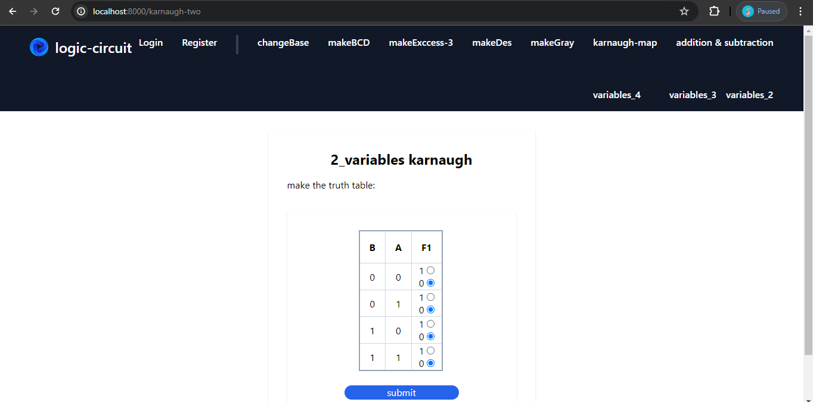
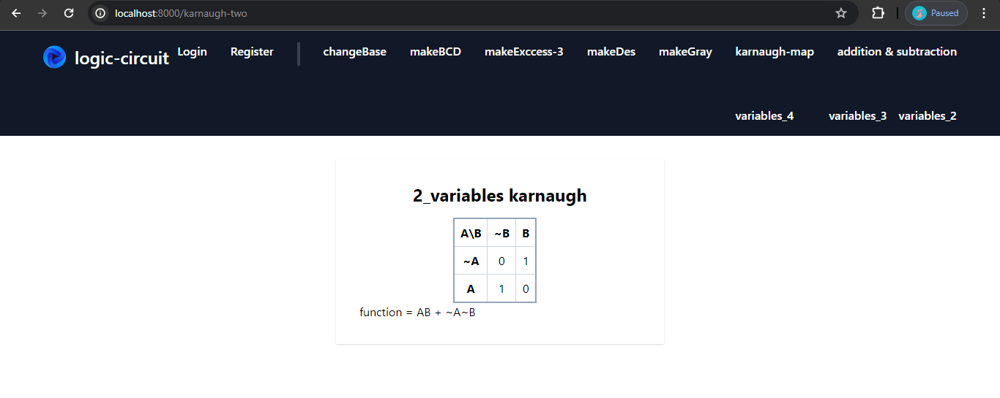
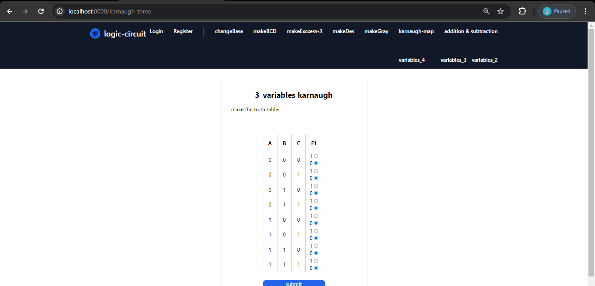
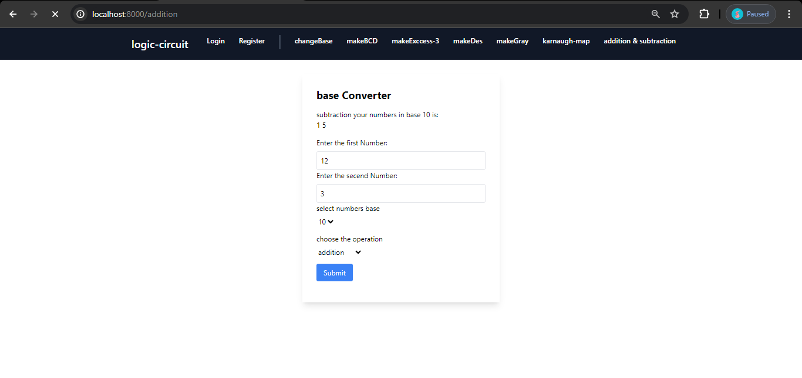
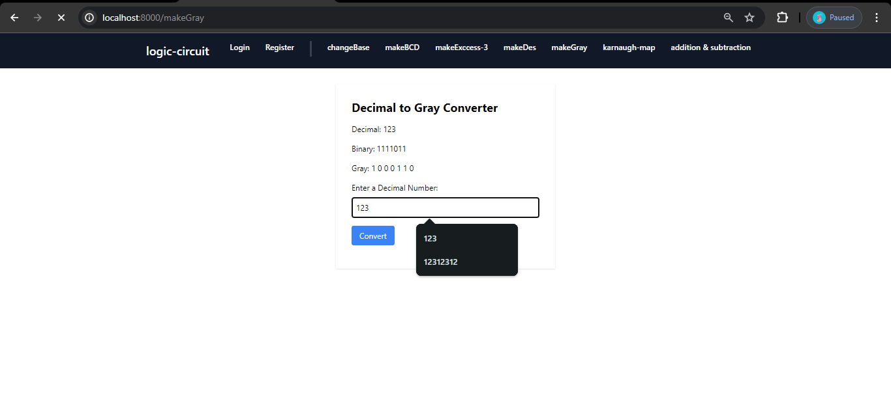

## About This App 
there is some sections : 
- base Converter
- Decimal to BCD Converter
- Decimal to makeExccess-3
- Gray to Decimal Converter
- Decimal to Gray Converter
- karnaugh-map (3, 4 and 5 variables)
- addition & subtraction
- also Laravel authentication section is provided in this app. 
- images : 

